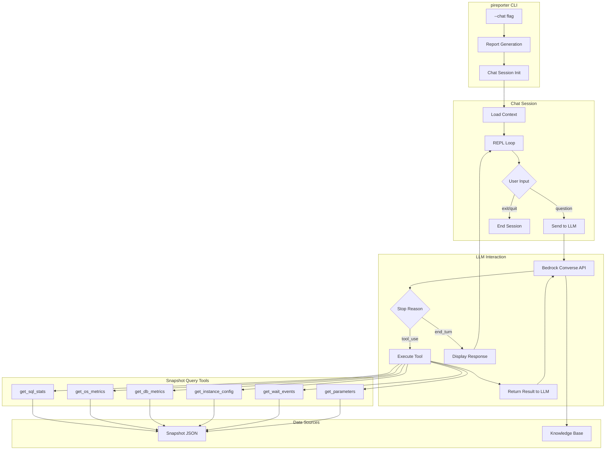

# Design Document: Interactive Chat Mode

## Overview

This design describes the implementation of an interactive chat mode for pireporter that allows users to ask natural language questions about their performance reports. After LLM recommendations are generated, users can enter a chat session where they converse with the AI. The LLM uses Bedrock's Converse API with tool use capabilities to query specific parts of the snapshot data when needed to answer questions.

The chat mode integrates with the existing `genai.js` infrastructure and leverages the engine-specific knowledge base files to provide contextual, accurate responses about database performance.

## Architecture



## Components and Interfaces

### 1. ChatSession Class

A new class in `chatSession.js` that manages the interactive chat loop.

```javascript
class ChatSession {
  constructor(options) {
    this.type = options.type;           // 'single_snapshot' or 'compare'
    this.snap1 = options.snap1;         // Primary snapshot data
    this.snap2 = options.snap2;         // Secondary snapshot (for compare mode)
    this.initialReport = options.report; // LLM-generated report HTML
    this.messages = [];                  // Conversation history
    this.knowledge = '';                 // Engine-specific knowledge
    this.eventDescriptions = {};         // Wait event descriptions
  }

  async initialize()              // Load knowledge base, prepare context
  async start()                   // Begin REPL loop
  async processUserInput(input)   // Handle user question
  async sendToLLM(userMessage)    // Call Bedrock Converse API
  executeTool(toolName, toolInput) // Execute requested tool
  formatToolResult(result)        // Format tool output for LLM
  async summarizeHistory()        // Summarize old messages when context grows
  end()                           // Clean up and exit
}
```

### 2. Tool Definitions

Tools are defined following Bedrock's toolSpec format:

```javascript
const toolDefinitions = {
  tools: [
    {
      toolSpec: {
        name: "get_sql_stats",
        description: "Get statistics for a specific SQL statement by its ID. Returns dbload, pct_aas, additional metrics, SQL text, load by database, load by user, and wait event breakdown.",
        inputSchema: {
          json: {
            type: "object",
            properties: {
              sql_id: {
                type: "string",
                description: "The SQL ID to look up (e.g., 'abc123def456')"
              },
              snapshot: {
                type: "string",
                enum: ["primary", "secondary", "both"],
                description: "Which snapshot to query. Use 'both' for compare mode."
              }
            },
            required: ["sql_id"]
          }
        }
      }
    },
    {
      toolSpec: {
        name: "get_os_metrics",
        description: "Get OS-level metrics like CPU, memory, disk I/O. Can query by category or specific metric name.",
        inputSchema: {
          json: {
            type: "object",
            properties: {
              category: {
                type: "string",
                description: "Metric category (e.g., 'cpuUtilization', 'memory', 'diskIO')"
              },
              metric_name: {
                type: "string",
                description: "Specific metric name within the category"
              },
              snapshot: {
                type: "string",
                enum: ["primary", "secondary", "both"],
                description: "Which snapshot to query"
              }
            }
          }
        }
      }
    },
    {
      toolSpec: {
        name: "get_db_metrics",
        description: "Get database-level metrics like connections, transactions, buffer usage.",
        inputSchema: {
          json: {
            type: "object",
            properties: {
              category: {
                type: "string",
                description: "Metric category"
              },
              metric_name: {
                type: "string",
                description: "Specific metric name"
              },
              snapshot: {
                type: "string",
                enum: ["primary", "secondary", "both"],
                description: "Which snapshot to query"
              }
            }
          }
        }
      }
    },
    {
      toolSpec: {
        name: "get_instance_config",
        description: "Get instance configuration details like instance class, engine version, storage type, cluster info.",
        inputSchema: {
          json: {
            type: "object",
            properties: {
              fields: {
                type: "array",
                items: { type: "string" },
                description: "Specific fields to return. If empty, returns all configuration."
              },
              snapshot: {
                type: "string",
                enum: ["primary", "secondary", "both"],
                description: "Which snapshot to query"
              }
            }
          }
        }
      }
    },
    {
      toolSpec: {
        name: "get_wait_events",
        description: "Get wait event information including event name, type, time, and percentage of DB time.",
        inputSchema: {
          json: {
            type: "object",
            properties: {
              event_name: {
                type: "string",
                description: "Specific wait event name to look up"
              },
              snapshot: {
                type: "string",
                enum: ["primary", "secondary", "both"],
                description: "Which snapshot to query"
              }
            }
          }
        }
      }
    },
    {
      toolSpec: {
        name: "get_parameters",
        description: "Get database parameter settings, specifically non-default parameters.",
        inputSchema: {
          json: {
            type: "object",
            properties: {
              parameter_name: {
                type: "string",
                description: "Specific parameter name to look up"
              },
              snapshot: {
                type: "string",
                enum: ["primary", "secondary", "both"],
                description: "Which snapshot to query"
              }
            }
          }
        }
      }
    }
  ]
};
```

### 3. Tool Executor

A module that executes tools against snapshot data:

```javascript
// toolExecutor.js
class ToolExecutor {
  constructor(snap1, snap2 = null) {
    this.snap1 = snap1;
    this.snap2 = snap2;
  }

  execute(toolName, input) {
    switch (toolName) {
      case 'get_sql_stats':
        return this.getSqlStats(input);
      case 'get_os_metrics':
        return this.getOsMetrics(input);
      case 'get_db_metrics':
        return this.getDbMetrics(input);
      case 'get_instance_config':
        return this.getInstanceConfig(input);
      case 'get_wait_events':
        return this.getWaitEvents(input);
      case 'get_parameters':
        return this.getParameters(input);
      default:
        return { error: `Unknown tool: ${toolName}` };
    }
  }

  getSqlStats(input) { /* ... */ }
  getOsMetrics(input) { /* ... */ }
  getDbMetrics(input) { /* ... */ }
  getInstanceConfig(input) { /* ... */ }
  getWaitEvents(input) { /* ... */ }
  getParameters(input) { /* ... */ }
}
```

### 4. Bedrock Converse Integration

Extension to existing genai.js to support Converse API with tools:

```javascript
// In genai.js or new converseClient.js
const { BedrockRuntimeClient, ConverseCommand } = require("@aws-sdk/client-bedrock-runtime");

async function converseWithTools(client, modelId, messages, systemPrompt, toolConfig) {
  const input = {
    modelId: modelId,
    messages: messages,
    system: [{ text: systemPrompt }],
    toolConfig: toolConfig,
    inferenceConfig: {
      maxTokens: 4096,
      temperature: 0.1
    }
  };

  const command = new ConverseCommand(input);
  return await client.send(command);
}
```

### 5. CLI Integration

Updates to pireporter.js:

```javascript
// New option definition
{ name: 'chat', alias: 't', type: Boolean, 
  description: 'Enter interactive chat mode after report generation to ask questions about the data.' }

// In report generation flow
if (options["chat"]) {
  // Ensure AI analysis is enabled
  options["ai-analyzes"] = true;
  
  // After report generation, start chat session
  const { ChatSession } = require('./chatSession');
  const session = new ChatSession({
    type: 'single_snapshot', // or 'compare'
    snap1: snapshotObject,
    snap2: snapshotObject2, // if compare mode
    report: htmlReport
  });
  await session.initialize();
  await session.start();
}
```

## Data Models

### Message Format (Bedrock Converse API)

```javascript
// User message
{
  role: "user",
  content: [{ text: "Why is my database slow?" }]
}

// Assistant message with tool use
{
  role: "assistant",
  content: [
    { 
      toolUse: {
        toolUseId: "tool_123",
        name: "get_wait_events",
        input: { snapshot: "primary" }
      }
    }
  ]
}

// Tool result message
{
  role: "user",
  content: [
    {
      toolResult: {
        toolUseId: "tool_123",
        content: [{ json: { /* tool output */ } }]
      }
    }
  ]
}

// Assistant final response
{
  role: "assistant",
  content: [{ text: "Based on the wait events, your database is experiencing..." }]
}
```

### Conversation Context Structure

```javascript
{
  systemPrompt: "You are a database performance expert...",
  initialReport: "<h2>Summary:</h2>...",
  messages: [
    { role: "user", content: [...] },
    { role: "assistant", content: [...] },
    // ... conversation history
  ],
  tokenCount: 12500,
  maxTokens: 100000
}
```

## Correctness Properties

*A property is a characteristic or behavior that should hold true across all valid executions of a system—essentially, a formal statement about what the system should do. Properties serve as the bridge between human-readable specifications and machine-verifiable correctness guarantees.*


Property 1: Valid identifier lookup returns correct data
*For any* tool (SQL, OS metrics, DB metrics, instance config, wait events, parameters) and *for any* valid identifier in the snapshot, invoking the tool with that identifier SHALL return the corresponding data from the snapshot.
**Validates: Requirements 2.2, 2.3, 3.2, 3.3, 4.2, 4.3, 5.2, 5.3, 6.2, 6.3, 7.2, 7.3**

Property 2: Invalid identifier returns not found
*For any* tool and *for any* identifier NOT present in the snapshot, invoking the tool with that identifier SHALL return a "not found" message.
**Validates: Requirements 2.4, 3.4, 4.4, 6.4, 7.4**

Property 3: Compare mode returns both snapshots
*For any* tool query with snapshot parameter set to "both", the result SHALL contain data from both the primary and secondary snapshots with clear labeling distinguishing which data came from which snapshot.
**Validates: Requirements 2.5, 3.5, 4.5, 5.4, 6.5, 7.5**

Property 4: Knowledge base loaded based on engine
*For any* snapshot with a recognized database engine, initializing a ChatSession SHALL load the corresponding knowledge base file (e.g., aurora-postgresql.txt for aurora-postgresql engine).
**Validates: Requirements 8.1**

Property 5: Wait event descriptions included
*For any* wait event returned by the wait event tool, if that event exists in events.json or events_primary.json, the result SHALL include the event's description from the knowledge base.
**Validates: Requirements 8.3**

Property 6: Conversation history preserved
*For any* sequence of N user messages in a chat session, the (N+1)th LLM call SHALL include all N previous user messages and their corresponding assistant responses in the messages array.
**Validates: Requirements 9.2**

Property 7: History summarization on overflow
*For any* conversation where the total token count exceeds the configured maximum, the ChatSession SHALL summarize older messages while preserving the most recent K messages intact.
**Validates: Requirements 9.3**

Property 8: Tool results retained in context
*For any* tool call made during a conversation, the tool result message SHALL remain in the conversation history for subsequent LLM calls.
**Validates: Requirements 9.4**

Property 9: Tool calls parsed and executed correctly
*For any* LLM response with stopReason "tool_use", the system SHALL correctly parse the toolUse content, execute the corresponding tool function, and return a properly formatted toolResult message.
**Validates: Requirements 10.3**

Property 10: Multiple sequential tool calls supported
*For any* LLM response containing multiple toolUse blocks, the system SHALL execute all requested tools and return all results before the next LLM call.
**Validates: Requirements 10.4**

Property 11: Tool errors returned gracefully
*For any* tool execution that throws an exception, the system SHALL return a toolResult message with status "error" and a descriptive error message, rather than crashing.
**Validates: Requirements 10.5**

## Error Handling

### Tool Execution Errors

When a tool fails to execute (e.g., invalid input, missing data):

```javascript
try {
  const result = toolExecutor.execute(toolName, toolInput);
  return {
    toolUseId: tool.toolUseId,
    content: [{ json: result }]
  };
} catch (error) {
  return {
    toolUseId: tool.toolUseId,
    content: [{ text: `Error executing ${toolName}: ${error.message}` }],
    status: 'error'
  };
}
```

### Bedrock API Errors

- **ThrottlingException**: Implement exponential backoff with retry (similar to existing genai.js pattern)
- **ValidationException**: Log error and inform user of invalid request
- **ModelTimeoutException**: Retry once, then inform user

### Input Validation

- Validate user input is non-empty before sending to LLM
- Sanitize tool inputs to prevent injection
- Validate snapshot data structure on initialization

### Graceful Degradation

- If knowledge base files are missing, continue without them (log warning)
- If event description files are missing, return events without descriptions
- If compare mode requested but only one snapshot available, fall back to single mode

## Testing Strategy

### Unit Tests

Unit tests focus on specific examples and edge cases:

1. **CLI Integration Tests**
   - Test `--chat` flag is recognized
   - Test `--chat` auto-enables `--ai-analyzes`
   - Test help text includes chat option

2. **Tool Executor Tests**
   - Test each tool with valid inputs
   - Test each tool with invalid inputs
   - Test compare mode data formatting

3. **ChatSession Tests**
   - Test initialization loads knowledge base
   - Test "exit" and "quit" commands
   - Test welcome message display

### Property-Based Tests

Property tests verify universal properties across generated inputs. Each test runs minimum 100 iterations.

**Test Configuration:**
- Framework: fast-check (JavaScript property-based testing library)
- Minimum iterations: 100 per property
- Shrinking enabled for failure case minimization

**Property Test Implementation Pattern:**

```javascript
const fc = require('fast-check');

// Feature: interactive-chat-mode, Property 1: Valid identifier lookup returns correct data
test('Property 1: Valid identifier lookup returns correct data', () => {
  fc.assert(
    fc.property(
      arbitrarySnapshot(),
      arbitraryValidSqlId(snapshot),
      (snapshot, sqlId) => {
        const executor = new ToolExecutor(snapshot);
        const result = executor.execute('get_sql_stats', { sql_id: sqlId });
        
        // Result should contain the SQL data
        expect(result.sql_id).toBe(sqlId);
        expect(result.dbload).toBeDefined();
        expect(result.pct_aas).toBeDefined();
      }
    ),
    { numRuns: 100 }
  );
});

// Feature: interactive-chat-mode, Property 2: Invalid identifier returns not found
test('Property 2: Invalid identifier returns not found', () => {
  fc.assert(
    fc.property(
      arbitrarySnapshot(),
      arbitraryInvalidSqlId(),
      (snapshot, invalidId) => {
        const executor = new ToolExecutor(snapshot);
        const result = executor.execute('get_sql_stats', { sql_id: invalidId });
        
        expect(result.error).toContain('not found');
      }
    ),
    { numRuns: 100 }
  );
});

// Feature: interactive-chat-mode, Property 3: Compare mode returns both snapshots
test('Property 3: Compare mode returns both snapshots', () => {
  fc.assert(
    fc.property(
      arbitrarySnapshot(),
      arbitrarySnapshot(),
      arbitraryToolName(),
      (snap1, snap2, toolName) => {
        const executor = new ToolExecutor(snap1, snap2);
        const result = executor.execute(toolName, { snapshot: 'both' });
        
        expect(result.primary).toBeDefined();
        expect(result.secondary).toBeDefined();
      }
    ),
    { numRuns: 100 }
  );
});
```

### Integration Tests

- Test full conversation flow with mocked Bedrock responses
- Test tool use loop (user question → tool call → tool result → final response)
- Test context management across multiple turns
